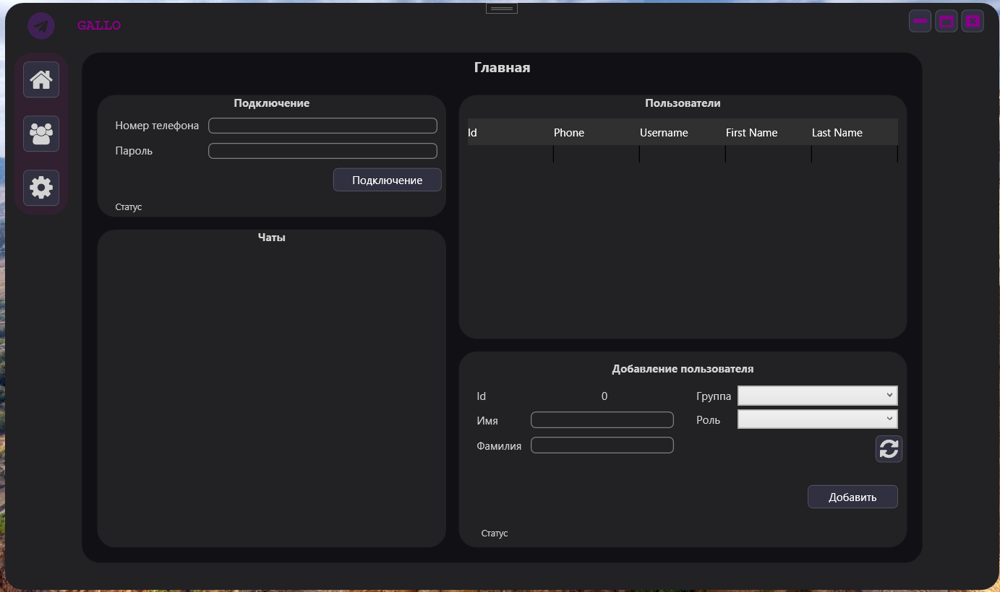
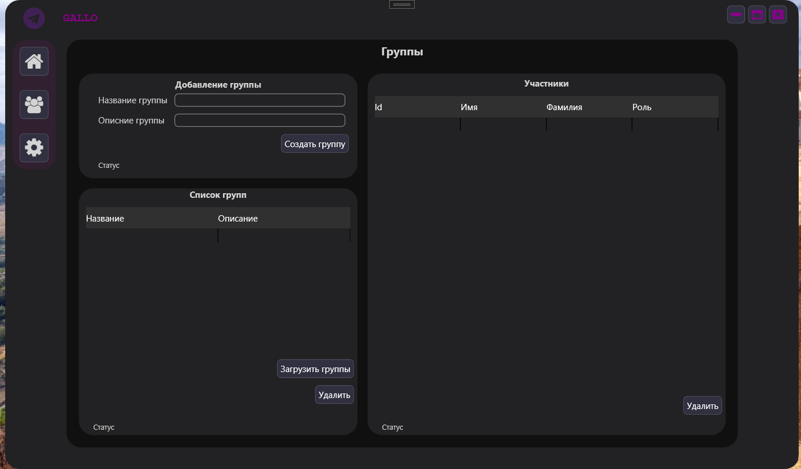

# GroupAllocator
  
### Stack  
NET 8; C# ASP NET Minimal Web API; WPF; EF Core; SQLite; Telegram.Bot; WTelegramClient;
### Бизнес  
Данный проект предназначен для создания анонимных групп внутри бота. Каждая группа имеет одного владельца (руководителя) и участников. Таких групп может быть много.  
Правила: участник одной группы не может писать участникам в собственной группе, но может писать руководителю. Участники не видят, что пишут другие участники и руководитель. Руководитель может писать любому участнику своей группы. Каждому участнику присваивается порядковый номер. Руководитель может написать участнику сообщение, например, "1. Привет", где 1. - это обращение к участнику с порядковым номером 1.
### Требования
Платформа - Windows (сервер можно запустить, где угодно, но админка - только Windows).  
Для старта потребуются переменные среды:  
`ASPNETCORE_URLS` - адрес хоста API (например, по умолчанию - http://localhost:5043);  
`ACCESS_API_TOKEN` - токен для взаимодействия с API сервера (устанавливаете любое свое значение);  
`TELEGRAM_API_HASH` - api hash для взаимодействия с чатами пользователя в админке - выдаётся Telegram. Детальнее https://core.telegram.org/api/obtaining_api_id;  
`TELEGRAM_API_ID` - api id для взаимодействия с чатами пользователя в админке - выдаётся Telegram. Детальнее https://core.telegram.org/api/obtaining_api_id;  
`TELEGRAM_BOT_TOKEN` - токен бота, который выдаётся при создании бота через https://t.me/BotFather;  
### Описание  
Приложение состоит из двух частей:  
- Сервреная часть (ASP net): предоставляет API для взаимодействия с БД и телеграм-ботом. (backend)
- Админская часть (WPF): взаимодействие с чатами пользователя, создание/удаление групп, добавление/удаление участников/руководителей групп, выдача ролей участникам. (frontend)  
### Desktop
  
  
