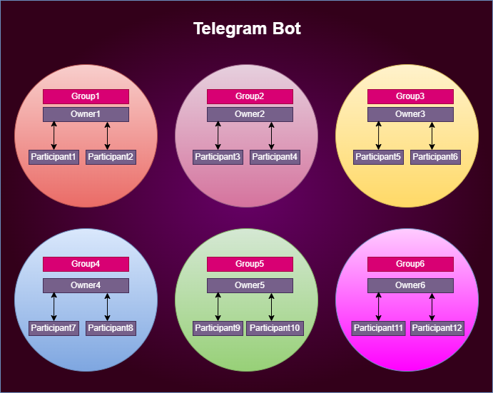

# GroupAllocator
  
### Stack  
NET 8; C# ASP NET Minimal Web API; WPF; EF Core; SQLite; Telegram.Bot; WTelegramClient;
### Требования
Платформа - Windows (сервер можно запустить, где угодно, но админка - только Windows). Для работы с админкой требуется запущенный сервер на том устройстве, где запускается админка, т.к. админка - Desktop приложение под Windows.  
Общение сервера с десктоп происходит по http://localhost:5073.  
Для старта потребуются переменные среды:  
`ACCESS_API_TOKEN` - токен для взаимодействия с API сервера (устанавливаете любое свое значение);  
`TELEGRAM_API_HASH` - api hash для взаимодействия с чатами пользователя в админке. Полная информация, где получить - здесь https://core.telegram.org/api/obtaining_api_id;  
`TELEGRAM_API_ID` - api id для взаимодействия с чатами пользователя в админке. Полная информация, где получить - здесь https://core.telegram.org/api/obtaining_api_id;  
`TELEGRAM_BOT_TOKEN` - токен бота, который выдаётся при создании бота через https://t.me/BotFather;  
### Описание  
Приложение состоит из двух частей:  
- Сервреная часть (ASP net): предоставляет API для взаимодействия с БД и телеграм-ботом. (backend)
- Админская часть (WPF): взаимодействие с чатами пользователя, создание/удаление групп, добавление/удаление участников/руководителей групп, выдача ролей участникам.
### Интерфейс приложения админки

